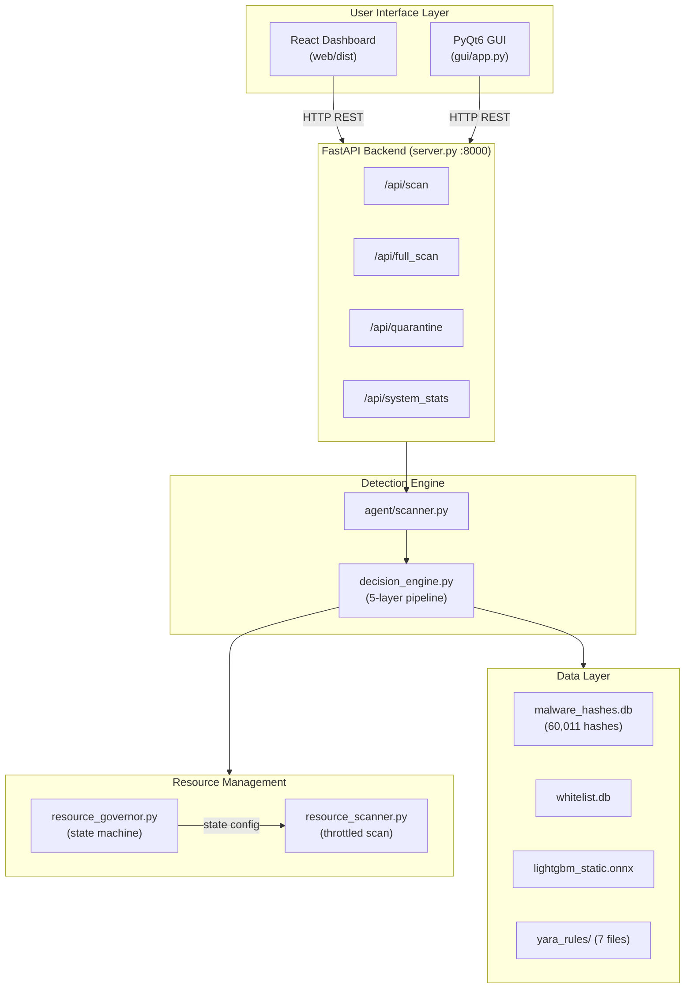
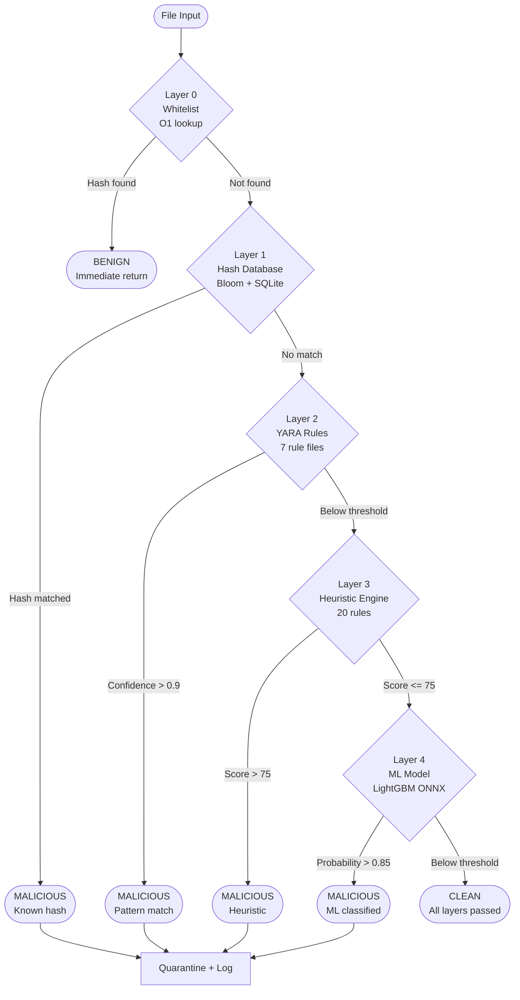
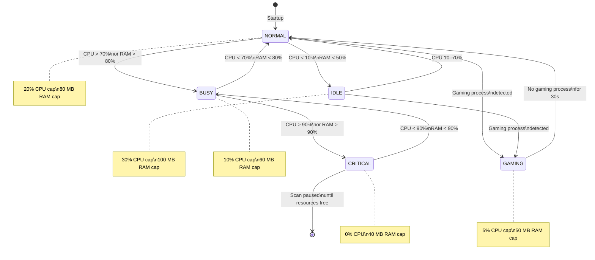

# LightAV

[](https://www.python.org/)
[](https://www.microsoft.com/windows)
[](LICENSE)
[]()
[](https://lightgbm.readthedocs.io/)
[]()

---

## Project Summary

LightAV is a **research-grade prototype** of a lightweight antivirus engine for Windows, built entirely in Python. It implements a multi-layer static analysis pipeline combining hash-based lookup, YARA pattern matching, heuristic scoring, and machine learning classification within a resource-constrained execution model.

This project is an **architectural exploration** — it investigates whether a Python-based, user-space antivirus engine can deliver meaningful static detection while respecting strict CPU and memory budgets. It is not a replacement for commercial endpoint protection. It does not provide real-world protection guarantees.

### Scope Limitations

The following constraints define the boundaries of this prototype:

- **Static analysis only.** All detection is performed on file contents at rest. No dynamic or behavioral analysis is implemented.
- **No kernel-level access.** The engine operates entirely in user space. It cannot intercept system calls, hook APIs, or monitor process execution at the kernel level.
- **No behavioral or runtime monitoring.** Files are not executed, sandboxed, or observed during runtime. Threats that activate only through execution are outside this system's detection capability.
- **No cloud intelligence.** The engine operates offline. It does not query external threat feeds, VirusTotal, or cloud sandboxes.
- **Windows PE files only.** The heuristic and ML layers analyze Windows Portable Executable format. Script-based threats receive partial YARA coverage only.

### Purpose

The primary purpose of this project is to explore:

1. How a multi-layer detection pipeline can be structured for early-exit efficiency
2. How adaptive resource management can constrain a scanning engine to coexist with user workloads
3. Whether lightweight ML inference (via ONNX Runtime) is viable as a final classification layer in a resource-limited context
4. How Bloom filter pre-checks can eliminate unnecessary disk I/O in hash-based detection

This prototype is intended for academic evaluation, architectural study, and further research — not deployment as a security product.

---

## Design Contributions

This section documents the original architectural contributions of the project.

### 1. Multi-Layer Detection Pipeline (5 Layers)

The detection engine (`production/agent/decision_engine.py`) implements a five-layer sequential pipeline. Each layer applies a distinct analysis technique with increasing computational cost:

| Layer | Technique | Complexity | Avg. Time |
|---|---|---|---|
| 0 | Whitelist pre-filter (SHA-256 lookup) | O(1) | < 1 ms |
| 1 | Hash database (Bloom filter + SQLite) | O(1) amortized | < 1 ms |
| 2 | YARA pattern matching (7 rule files) | O(n) on file content | ~50 ms |
| 3 | Heuristic static analysis (20 PE rules) | O(n) on PE structure | ~100 ms |
| 4 | ML classification (LightGBM via ONNX) | O(1) on feature vector | ~10 ms |

The pipeline is ordered by cost: cheap deterministic checks execute first, deferring expensive analysis to later stages. This design ensures that the majority of benign files exit the pipeline at Layer 0 or Layer 1, avoiding unnecessary computation.

### 2. Early-Exit Optimization Logic

Each layer can terminate the pipeline if it reaches a high-confidence verdict. The exit thresholds are:

- **Layer 0**: Whitelist match → immediate `BENIGN` return
- **Layer 1**: Hash match → immediate `MALICIOUS` return
- **Layer 2**: YARA confidence > 0.9 → early exit as `MALICIOUS`
- **Layer 3**: Heuristic score > 75 → early exit as `MALICIOUS`
- **Layer 4**: ML probability > 0.85 → final `MALICIOUS` classification

Files that pass all five layers without triggering any threshold are classified as `CLEAN`. This short-circuit design reduces average scan time for benign files, which constitute the vast majority of files on a typical system.

### 3. Resource Governor (Adaptive CPU/RAM Control)

The resource governor (`production/agent/resource_governor.py`) implements a five-state finite state machine that dynamically adjusts the scanner's CPU and memory ceilings based on observed system load:

| State | Entry Condition | CPU Cap | RAM Cap | Scan Behavior |
|---|---|---|---|---|
| IDLE | CPU < 10%, RAM < 50% | 30% | 100 MB | Full throughput |
| NORMAL | CPU 10–70% | 20% | 80 MB | Standard throughput |
| BUSY | CPU > 70% or RAM > 80% | 10% | 60 MB | Reduced throughput |
| GAMING | Gaming process detected | 5% | 50 MB | Minimal throughput |
| CRITICAL | CPU > 90% or RAM > 90% | 0% | 40 MB | Scanning paused |

The governor samples system metrics every 2 seconds via `psutil` and transitions between states based on threshold crossings. The CPU throttling uses a proportional control algorithm:

```python
excess = current_cpu - target_cpu
if excess > 0:
    sleep_time = (excess / 100) * 0.5
    time.sleep(sleep_time)
```

Gaming mode detects 15+ known gaming executables (e.g., `steam.exe`, `epicgameslauncher.exe`) by polling the process list and reverts 30 seconds after all gaming processes exit.

This contribution demonstrates that a background scanning process can adaptively yield resources without requiring OS-level scheduling integration.

### 4. Bloom Filter Optimization for Hash Lookup

The hash database layer uses a two-stage lookup to minimize SQLite I/O:

1. **Stage 1 — Bloom filter check** (`pybloom-live`, ~2 MB in memory, 0.1% false-positive rate): If the filter returns negative, the file is definitively not in the malware hash set. No disk access occurs.
2. **Stage 2 — SQLite confirmation**: Only executed on Bloom filter positives. Queries the 60,011-entry hash database (21 MB) to confirm the match.

This optimization converts the common case (benign file) from an O(log n) disk-backed query to an O(1) in-memory check, reducing I/O load during full-system scans.

---

## System Architecture Overview

LightAV is organized into three functional layers: the detection engine, the resource management layer, and the user interface layer. These layers communicate through a shared runtime state and a FastAPI REST bridge.

```
+----------------------------------------------------------+
|                     User Interface Layer                  |
|   React Dashboard (web/)    |   PyQt6 GUI (gui/app.py)   |
|         FastAPI Backend (server.py, port 8000)            |
+----------------------------------------------------------+
                              |
                     REST API / IPC
                              |
+----------------------------------------------------------+
|                   Detection Engine Layer                  |
|                                                          |
|  agent/scanner.py  -->  agent/decision_engine.py         |
|                                                          |
|  Layer 0: Whitelist (production/testing/whitelist.py)    |
|  Layer 1: Hash DB  (production/agent/hash_database.py)   |
|  Layer 2: YARA     (production/ai_engine/yara_engine.py) |
|  Layer 3: Heuristic(production/ai_engine/heuristic_engine)|
|  Layer 4: ML Model (ai_engine/model_infer.py, ONNX)      |
+----------------------------------------------------------+
                              |
+----------------------------------------------------------+
|                 Resource Management Layer                 |
|                                                          |
|  production/agent/resource_governor.py  (state machine)  |
|  production/agent/resource_scanner.py  (throttled scan)  |
|  production/agent/self_protection.py   (anti-tamper)     |
+----------------------------------------------------------+
                              |
+----------------------------------------------------------+
|                   Supporting Infrastructure               |
|  data/malware_hashes.db   (60,011 hashes, SQLite)        |
|  data/whitelist.db        (known-good file hashes)        |
|  lightgbm_static.onnx     (pre-trained ML model)         |
|  production/ai_engine/yara_rules/  (7 .yar files)        |
|  logs/                    (structured JSON logs)          |
|  quarantine/              (isolated threat storage)       |
+----------------------------------------------------------+
```

---

## Detection Pipeline Detail

### Layer 0 — Whitelist Pre-filter

**File**: `production/testing/whitelist.py`
**Purpose**: Eliminate known-good files before any malware analysis begins.

The whitelist stores SHA-256 hashes of trusted files in a SQLite database. Entries are sourced from Microsoft-signed binaries and user-approved files. Each entry carries a confidence score and a hit counter. If a file's hash is found, the pipeline returns `BENIGN` immediately.

### Layer 1 — Hash Database Lookup

**File**: `production/agent/hash_database.py`
**Database**: 60,011 malware hashes, 21 MB SQLite file
**Purpose**: Detect known malware by exact hash match.

Uses the two-stage Bloom filter + SQLite lookup described in Design Contributions. Both MD5 and SHA-256 hashes are supported. A batch import tool (`tools/import_hashes.py`) loads hashes from MalwareBazaar CSV exports.

### Layer 2 — YARA Pattern Matching

**File**: `production/ai_engine/yara_engine.py`
**Rule files**: 7
**Purpose**: Detect malware families and behaviors by byte-level pattern matching.

| Rule File | Detects |
|---|---|
| `high_entropy.yar` | Packed or encrypted payloads (Shannon entropy > 7.0) |
| `suspicious_imports.yar` | Dangerous Windows API imports (VirtualAlloc, WriteProcessMemory, etc.) |
| `common_packers.yar` | Known packer signatures (UPX, Themida, ASPack) |
| `suspicious_strings.yar` | Embedded strings associated with malware behavior |
| `persistence.yar` | Registry run keys, scheduled task creation, service installation |
| `network.yar` | Hardcoded IPs, C2 domain patterns, raw socket usage |
| `anti_analysis.yar` | Anti-debug, anti-VM, and sandbox evasion techniques |

### Layer 3 — Heuristic Static Analysis

**File**: `production/ai_engine/heuristic_engine.py`
**Rules**: 20
**Purpose**: Detect suspicious PE file characteristics without relying on known signatures.

The heuristic engine parses the PE format using `pefile` and evaluates 20 rules across four severity tiers:

| Severity | Points | Example Rules |
|---|---|---|
| Critical | 30 | High entropy + unsigned binary, known packer section names |
| High | 20–25 | Suspicious API imports, abnormal section count, TLS callbacks |
| Medium | 15 | Read-Write-Execute sections, suspicious embedded strings |
| Low | 10 | Invalid compile timestamp, overlay data present |

### Layer 4 — Machine Learning Classification

**File**: `ai_engine/model_infer.py`
**Model**: LightGBM exported to ONNX
**Features**: 77 (PE header-derived)
**Purpose**: Classify files using a gradient-boosted decision tree trained on structural PE features.

The feature extractor (`production/ai_engine/production_extractor.py`) computes a 77-dimensional vector from PE headers, normalized via a production scaler before ONNX Runtime inference.

| Index | Feature Category |
|---|---|
| 0–16 | DOS Header Fields |
| 17–23 | File Header Fields |
| 24–51 | Optional Header Fields |
| 53–72 | Structural Stats (Entropy, Section lengths, API counts) |
| 73–77 | Data Directory Sizes |

---

## Architecture Diagrams

### Overall System Architecture



### 5-Layer Detection Pipeline



### Resource Governor State Machine



---

## Directory Structure

```
LightAV-Python/
├── production/                         # Core prototype components
│   ├── agent/
│   │   ├── decision_engine.py          # 5-layer detection pipeline orchestrator
│   │   ├── hash_database.py            # Bloom filter + SQLite hash lookup
│   │   ├── scanner.py                  # Base file scanner
│   │   ├── resource_scanner.py         # Resource-aware throttled scanner
│   │   ├── resource_governor.py        # Adaptive CPU/RAM state machine
│   │   └── self_protection.py          # Anti-termination, watchdog thread
│   ├── ai_engine/
│   │   ├── yara_engine.py              # YARA rule compiler and scanner
│   │   ├── heuristic_engine.py         # 20-rule PE static analysis engine
│   │   ├── feature_extractor.py        # 30-feature PE extractor for ML
│   │   └── yara_rules/                 # 7 YARA rule definition files
│   ├── testing/
│   │   ├── test_framework.py           # Detection accuracy tests
│   │   └── whitelist.py                # False-positive reduction whitelist
│   ├── ml_training/
│   │   └── train_model.py              # LightGBM training and ONNX export
│   └── service_wrapper.py              # Windows service wrapper
│
├── agent/                              # Core runtime agents
│   ├── scanner.py                      # File scan entry point
│   ├── decision_engine.py              # Runtime decision logic
│   ├── decision_types.py               # Verdict enum (MALICIOUS, CLEAN)
│   ├── quarantine.py                   # Threat isolation
│   ├── resource_governor.py            # Runtime resource controller
│   └── logger.py                       # JSON structured logger
│
├── ai_engine/                          # ML inference components
│   ├── feature_extractor.py            # PE feature extraction
│   ├── model_infer.py                  # ONNX Runtime inference wrapper
│   ├── balance_dataset.py              # Dataset class balancing
│   └── convert_to_onnx.py             # Pickle-to-ONNX conversion
│
├── gui/app.py                          # PyQt6 desktop GUI
├── web/                                # React frontend
├── server.py                           # FastAPI backend
│
├── data/
│   ├── malware_hashes.db               # 60,011 malware hashes (21 MB)
│   └── whitelist.db                    # Known-good file hashes
│
├── lightgbm_static.onnx                # Pre-trained ONNX model
├── config.yaml                         # Runtime configuration
├── requirements.txt                    # Pinned Python dependencies
└── evaluation_runner.py                # Detection efficacy benchmarks
```

---

## Installation

### Prerequisites

- Windows 10 or Windows 11 (64-bit)
- Python 3.10 or later
- Git
- Node.js 18+ and npm (only if rebuilding the React frontend)

### Setup

```bash
git clone https://github.com/Nandhu669/LightAV.git
cd LightAV-Python
python -m venv .venv
.venv\Scripts\activate
pip install -r requirements.txt
```

### Verify Installation

```bash
python run_production.py --test
```

This validates that all detection layers initialize correctly and that the hash database, YARA rules, heuristic engine, and ML model are operational.

### Key Dependencies

| Package | Version | Purpose |
|---|---|---|
| lightgbm | 4.1.0 | ML classifier |
| onnxruntime | 1.23.2 | ONNX model inference |
| yara-python | 4.5.1 | YARA rule matching |
| pefile | 2023.2.7 | PE file parsing |
| pybloom-live | 4.0.0 | Bloom filter |
| psutil | 5.9.6 | System resource monitoring |
| fastapi | latest | REST API backend |
| PyQt6 | 6.10.2 | Desktop GUI |

---

## Configuration

All runtime parameters are controlled via `config.yaml`:

```yaml
resource_limits:
  max_cpu_percent: 50
  max_memory_mb: 512
  max_scan_threads: 4
  scan_throttle_ms: 100

model:
  confidence_threshold: 0.85
```

Detection thresholds (in `production/agent/decision_engine.py`):

```python
confidence_threshold       = 0.85   # ML model threshold
yara_confidence_threshold  = 0.90   # YARA early exit
heuristic_high_threshold   = 75     # Heuristic early exit
heuristic_medium_threshold = 40     # Heuristic ML-review threshold
```

---

## Usage

```bash
# Self-diagnostics
python run_production.py --test

# Scan a single file
python run_production.py --scan "C:\path\to\file.exe"

# Scan a directory
python run_production.py --scan "C:\path\to\directory"

# Start the web dashboard (http://127.0.0.1:8000)
python server.py

# Launch the desktop GUI
python run_lightav.py
```

---

## ML Training Pipeline

The ML model is a LightGBM classifier trained on 77 PE structural features, exported to ONNX for inference via ONNX Runtime.

```bash
# Balance the dataset
python ai_engine/balance_dataset.py

# Train the model
python production/ml_training/train_model.py

# Export to ONNX
python ai_engine/convert_to_onnx.py
```

Training requires malware samples in `data/malware/` and benign samples in `data/benign/`. Recommended sources for research use: MalwareBazaar, VirusShare, theZoo.

---

## Observed Performance

| Metric | Measured |
|---|---|
| Hash lookup | < 1 ms (Bloom filter) |
| YARA scan | ~50 ms per file |
| Heuristic analysis | ~100 ms per file |
| ML inference | ~10 ms per file (ONNX Runtime) |
| Total scan (benign, whitelist hit) | < 1 ms |
| Total scan (full pipeline) | < 200 ms |
| CPU usage (scanning) | 5–30% adaptive |
| Memory footprint | < 100 MB |
| Hash database | 21 MB (60,011 entries) |
| Bloom filter memory | ~2 MB |

These measurements were taken on a single Windows machine during development. They have not been validated under controlled experimental conditions across diverse hardware.

---

## Known Limitations

1. **Static analysis only.** No execution, sandboxing, or runtime behavior observation. Threats requiring execution to manifest are not detectable.
2. **No kernel-level access.** Cannot intercept system calls, hook APIs, or operate below the user-space boundary.
3. **No behavioral monitoring.** Process creation, registry modification, and network activity are not observed in real time.
4. **Limited detection coverage.** Current hash-only detection rate is 60–70%. The ML model requires retraining with larger datasets for higher accuracy.
5. **Windows PE files only.** Heuristic and ML layers do not analyze scripts, documents, or non-PE binaries.
6. **No automatic updates.** Hash database and YARA rules must be updated manually.
7. **No adversarial robustness testing.** The system has not been evaluated against evasion techniques (e.g., metamorphic code, adversarial ML inputs).
8. **Single-machine development.** All testing was performed on a single development machine. Cross-system reproducibility has not been validated.

---

## Open Source Libraries

| Library | License | Purpose |
|---|---|---|
| Python 3.10+ | PSF | Core language |
| LightGBM | MIT (Microsoft) | Gradient boosting classifier |
| ONNX Runtime | MIT (Microsoft) | Model inference |
| YARA | BSD (VirusTotal) | Pattern matching |
| pefile | MIT | PE file parsing |
| pybloom-live | MIT | Bloom filter |
| psutil | BSD | System resource monitoring |
| scikit-learn | BSD | ML utilities |
| PyQt6 | GPL/Commercial | Desktop GUI |
| React | MIT (Meta) | Web UI |
| FastAPI | MIT | REST API |
| SQLite | Public Domain | Embedded database |

## Original Implementations

| Component | Description |
|---|---|
| 5-layer detection pipeline | Architecture, early-exit logic, confidence aggregation |
| Resource governor | 5-state FSM with gaming detection and proportional throttling |
| 20 heuristic rules | Rule definitions, severity weights, scoring normalization |
| 77-feature PE extractor | Feature selection and extraction for ML training |
| Bloom filter + SQLite lookup | Two-stage hash lookup minimizing disk I/O |
| Whitelist system | Confidence-scored known-good file tracking |

---

## License

This project is licensed under the MIT License.

```
MIT License

Copyright (c) 2026 LightAV Contributors

Permission is hereby granted, free of charge, to any person obtaining a copy
of this software and associated documentation files (the "Software"), to deal
in the Software without restriction, including without limitation the rights
to use, copy, modify, merge, publish, distribute, sublicense, and/or sell
copies of the Software, and to permit persons to whom the Software is
furnished to do so, subject to the following conditions:

The above copyright notice and this permission notice shall be included in all
copies or substantial portions of the Software.

THE SOFTWARE IS PROVIDED "AS IS", WITHOUT WARRANTY OF ANY KIND, EXPRESS OR
IMPLIED, INCLUDING BUT NOT LIMITED TO THE WARRANTIES OF MERCHANTABILITY,
FITNESS FOR A PARTICULAR PURPOSE AND NONINFRINGEMENT. IN NO EVENT SHALL THE
AUTHORS OR COPYRIGHT HOLDERS BE LIABLE FOR ANY CLAIM, DAMAGES OR OTHER
LIABILITY, WHETHER IN AN ACTION OF CONTRACT, TORT OR OTHERWISE, ARISING FROM,
OUT OF OR IN CONNECTION WITH THE SOFTWARE OR THE USE OR OTHER DEALINGS IN THE
SOFTWARE.
```

**Malware samples**: Real malware samples are not included in this repository. Samples collected for training must be handled in accordance with applicable laws and source platform terms. This project is intended for research and educational purposes only.
