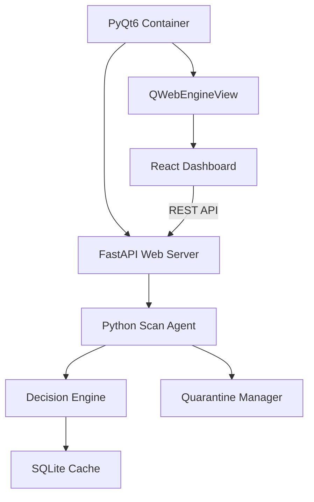

# 🛡️ LightAV: Next-Generation Lightweight Security

**LightAV** is a high-performance, premium antivirus solution designed for Windows. It leverages a state-of-the-art **hybrid architecture**, merging a robust Python-based scanning core with a modern, glassmorphic React dashboard to deliver enterprise-grade security analysis with a world-class user experience.

---

## 🚀 Key Highlights

*   **Hybrid Engine**: Seamlessly bridges low-level Python system access with a high-fidelity React frontend.
*   **Privacy-First**: Optimized for 100% offline operation—no telemetry, no cloud dependency.
*   **Intelligent Throttling**: Real-time system awareness automatically balances protection vs. performance.
*   **PE Forensic Logic**: Advanced static analysis ruleset focusing on entropy, imports, and section mapping.
*   **Premium UX**: A professional-grade dashboard featuring dark mode, micro-animations, and live metrics.

---

## 🛠️ Technology Stack

| Layer | Technology | Purpose |
| :--- | :--- | :--- |
| **Core Engine** |  | Decision logic, PE analysis, and OS interaction |
| **Frontend** |  | Professional dashboard & interactive visualizations |
| **GUI Container**|  | Native Windows window management & WebEngine |
| **API Bridge** |  | High-speed RESTful communication between UI and Core |
| **Database** |  | High-performance hash caching & metadata storage |

---

## 📦 System Architecture



### 1. The Scanning Core (`agent/`)
Our proprietary engine performs multi-stage static analysis. It verifies file signatures, calculates SHA-256 hashes, and applies a complex ruleset to evaluate the potential threat level of executable files without ever running them.

### 2. The Native Bridge (`gui/`)
Utilizing **QWebChannel**, the application provides a secure bridge between the sandboxed web dashboard and the Windows file system, enabling native features like system file pickers and desktop notifications.

### 3. The Digital Dashboard (`web/`)
A premium React application built with **TailwindCSS** and **Framer Motion**, offering real-time protection toggles, live system resource monitoring, and a comprehensive threat history.

---

## 🏁 Getting Started

### Prerequisites
- Windows 10/11 (x64)
- Python 3.10+
- Node.js 18+ (Development only)

### Installation
1.  **Clone the Repository**
    ```bash
    git clone https://github.com/your-org/LightAV-Python.git
    cd LightAV-Python
    ```
2.  **Environment Setup**
    ```bash
    python -m venv .venv
    source .venv/bin/activate  # Or `.venv\Scripts\activate` on Windows
    pip install -r requirements.txt
    ```
3.  **Launch**
    ```bash
    python run_lightav.py
    ```

---

## 🔍 Detailed Usage

### Operational Modes
*   **Standard GUI**: The full-featured interactive experience.
*   **Headless Agent**: `python run_lightav.py --agent` — Run as a background monitor.
*   **CLI Scanner**: `python run_lightav.py --scan <path>` — Direct integration for automated workflows.

### Managing Threats
When a file is flagged as **MALICIOUS**, LightAV automatically:
1.  Moves the file to a secure local `quarantine/` directory.
2.  Renames the file to prevent accidental execution.
3.  Generates a `.meta` file containing the original path, timestamp, and threat type.

---

## 🧪 Experimental Research
LightAV serves as a platform for AI-driven security research. We include pre-trained **LSTM** and **CNN** weights used for evaluating binary sequence patterns. While our production engine defaults to rule-based logic for zero-latency, the AI components are available for evaluation within the `ml_models` suite.

---

## ⚖️ Disclaimer
*LightAV is a cybersecurity research project. While it implements industry-standard protection patterns, it is provided "as-is" for educational purposes. Always use official, enterprise-certified security solutions for critical production environments.*

---

## 📜 License
Licensed under the **MIT License**. Created by the LightAV Security Team.

